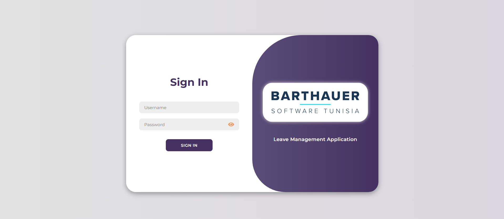
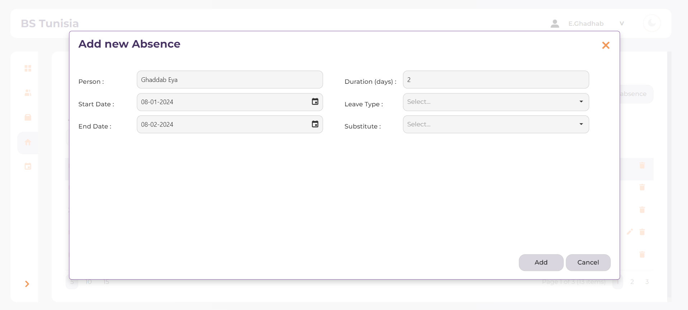
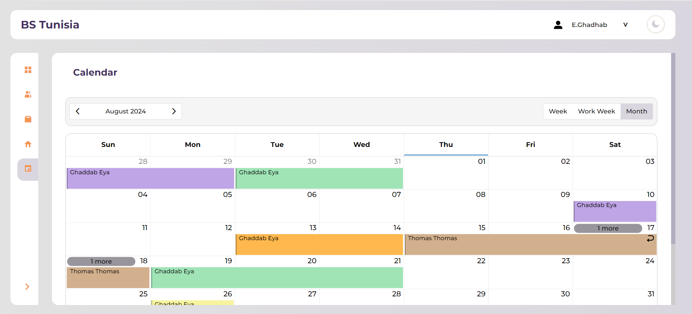

# Leave Management App

A robust and intuitive web application designed for managing employee leave requests and approvals. Built with Angular and DevExtreme, this application provides a seamless user experience by integrating with a backend API to handle different leave management functionalities effectively.

***

> Table of Contents
1. Overview
2. Features
3. ScreenShots
4. Technologies Used
5. Installation
6. License
7. Contact

***

## Overview
This Leave Management Application is a web-based solution designed to streamline the process of managing employee leave requests and approvals. Built with Angular and DevExtreme, the application provides a user-friendly interface and interacts with a backend API to fetch, manage, and display leave data efficiently.

## Features
* User Authentication: Secure login and session management for users.   
* Leave Request Management: Employees can request leave, view leave history, and track the status of their requests.      
* Dashboard: A comprehensive dashboard displaying leave statistics, upcoming leave schedules, and quick access to commonly    used features.    
* Team Overview: A section to view team members'.   
* Calendar View: Visual representation of leave schedules using a dynamic calendar component.   
* Dark Mode: Support for a dark theme for better readability in low-light environments.

## ScreenShots 
Here are some screenshots of the Leave Management App:

### Login Page

<div style="text-align: center">Form to login into the app</div>

### Leave Request Form

<div style="text-align: center">Form for submitting new leave requests</div>

### Calendar Overview

<div style="text-align: center">View of the team's leave schedules on a calendar</div>

## Technologies Used
<div style="display: flex; gap: 20px; flex-wrap: wrap;">

* <div style="background-color:blue;color:white;border-radius:5px;padding:10px;margin:5px;">
     Angular
  </div>

* <div style="background-color:#ffffff;color:#000000;border-radius:5px;padding:10px;margin:5px;">
     DevExtreme
  </div>  

</div>

## Installation
To set up the project locally, follow these steps:

  1. Clone the Repository:
  ```
  git clone https://github.com/AkramNsir/LeaveManagementApp.git
  ```

  2. Navigate to the Project Directory:
  ```
  cd LeaveManagementApp
  ```

  3. Install Dependencies:
  Ensure you have Node.js installed. Then run:
  ```
  npm install
  ```

  4. Set Up Environment Variables:
  Create an environment.ts file in the root directory and add the necessary environment variables. An example environment.ts file:
  ```
  export const environment = {
  url: your_base_api_url,
  apiUrlReadList: your_read_pick_list_api_url,
  apiUrlReadObject: your_read_object_api_url,
  apiUrlPersistObject: your_persist_object_api_url
  };
  ```

  5. Run the Application:
  ```
  ng serve
  ```
  The application will be available on http://localhost:4200.

## License
This project is licensed under the MIT License - see the LICENSE.md file for details.

## Contact
For any inquiries or issues, feel free to reach out:

Name: Mohamed Akram Nsir    
Email: akramnsir5@gamil.com    
GitHub: AkramNsir
